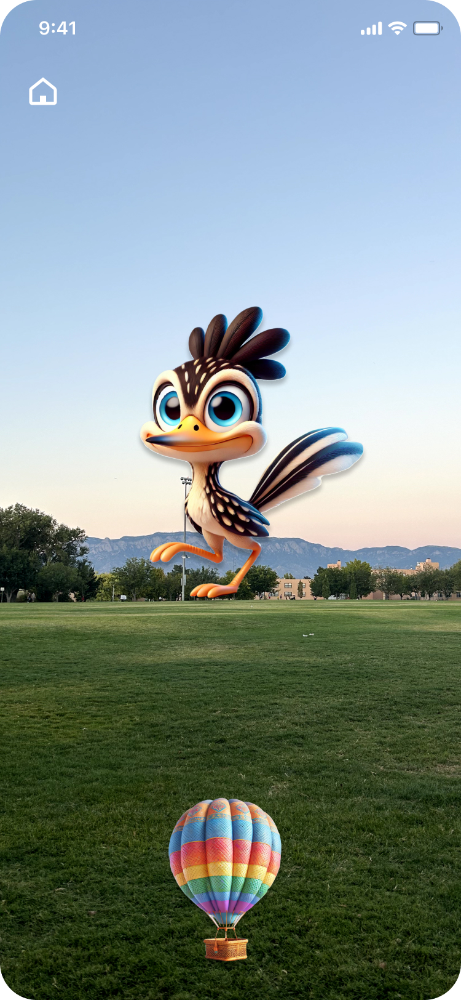
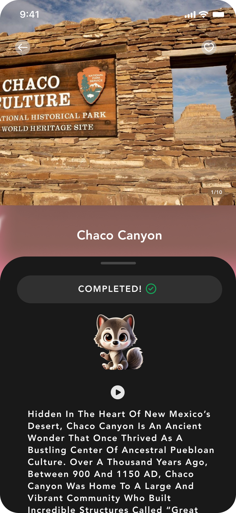

# Jornada de New Mexico

### Brief description of the app 

"Jornada de New Mexico" is an immersive tourism app that lets users explore New Mexico’s attractions while capturing characters by answering location-based quizzes. Through this engaging experience, users naturally learn educational information about each site in a fun and enjoyable way. 

----

### Figma Prototype 

https://www.figma.com/proto/QYmPiK4pXHrAuHSatse1yB/FindYourPack?node-id=0-1&t=AgyJAa29xYkqS6rv-1

---

### Team members 
#### Chaeeun Park 
(505) 210-1038 

chaeeun0618@unm.edu 

Chaeeun Park is a master’s student in CE, working as a research assistant on machine learning projects. She won first place in the 2024 NASA Apps Challenge. 

 
#### Molly Palko 

(505) 289-4022 

mpalko26@unm.edu 

Molly Palko is a senior majoring in Computer Science at the University of New Mexico. She is passionate about computer science education and currently serves as an instructor and section leader for a freshman-level CS course, where she helps guide students through their early experiences in the major. She is always eager to expand my knowledge, collaborate on exciting projects, and explore ways to combine computer science with various other interests. 

 
#### Dayeon Yoo 

(505) 453-1512 

udayeon@unm.edu 

Dayeon is a senior majoring in Computer Science at the University of New Mexico. She has experience co-founded the startup, and she is currently leading a photo booth app project. She thrives on learning new technologies and enjoys turning ideas into impactful solutions. She won first place in the 2024 NASA Space Apps Challenge. 

---

### Screen shots of the application
<table>
  <tr>
   <td></td>
    <td></td>
    <td></td>
    
  </tr>
</table>

